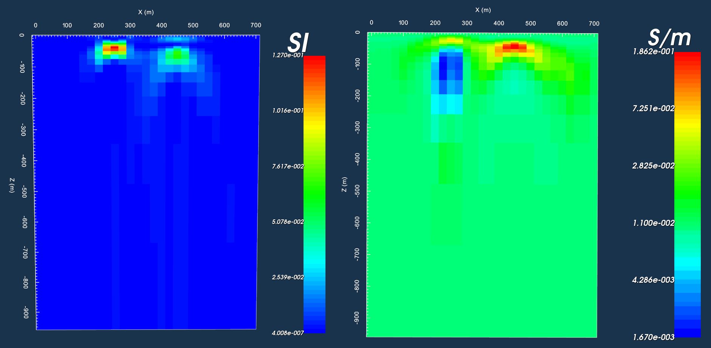

Examples
========

Example 1: Single Sounding
--------------------------

Here, we consider the forward modeling and inversion of DIGHEM-style data, collected over a 3-layered Earth model. Data were collected at 5 frequencies for a single sounding. The inversion was performed using algorithm 2 (:ref:`discrepancy principal<theory_inversion_disc>`) and set to recover a conductivity model and a positive susceptibility model (:ref:`mtype = 3<invL3>`).

.. figure:: images/fwd_mod.png
    :align: center
    :figwidth: 40%

    True model

- `Download zip file for example 1 <https://github.com/ubcgif/em1dfm/raw/master/assets/example_1.zip>`__, which contains all the files necessary to run the forward and inverse problems.

Example 2: Multiple Soundings
-----------------------------

Here, we consider a line of small loop FEM data collected over two anomalous bodies. The westernmost body is resistive and highly susceptible while the easternmost body is conductive and moderately susceptible. The original data were produced synthetically with 3D FEM codes. The observation file contains data collected for 29 soundings at 10 frequencies. The inversion was performed using the algorithm 4 (:ref:`L-curve criterion<theory_inversion_lcurve>`) and set to recover both a conductivity model and a positive susceptibility model (:ref:`mtype = 3<invL3>`). Since there are multiple soundings (29), the conductivity and susceptibility model files contain one physical property model for each sounding. As we can see, localized 1D inversion produce artifacts due to the 3D nature of the problem. However, the depth to each target and their horizontal locations are well-resolved.

    Stitched susceptibility and conductivity models recovered from inversion.

- `Download zip file for example 2 <https://github.com/ubcgif/em1dfm/raw/master/assets/example_2.zip>`__, which contains all the files necessary to run the inverse problems.

