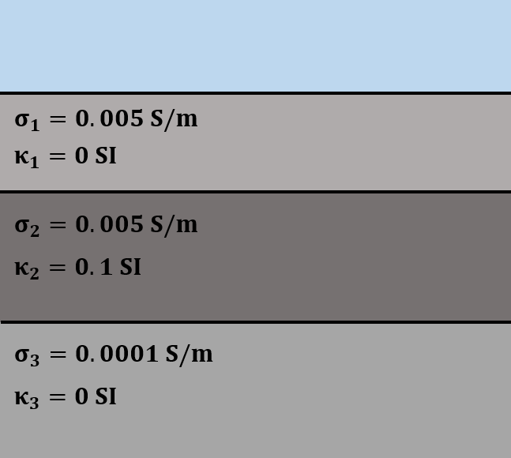

Examples
========

Example 1
---------

Here, we consider the forward modeling and inversion of DIGHEM-style data, collected over a 3-layered Earth model. Data were collected at 5 frequencies for a single sounding. The inversion was performed using algorithm 2 (:ref:`discrepancy principal<theory_inversion_disc>`) and set to recover a conductivity model and a positive susceptibility model (:ref:`mtype = 3<invL3>`).

    True model

- `Download zip file for example 1 <https://github.com/ubcgif/em1dfm/raw/master/assets/example_1.zip>`__

Example 2
---------

