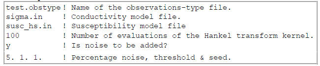
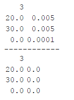
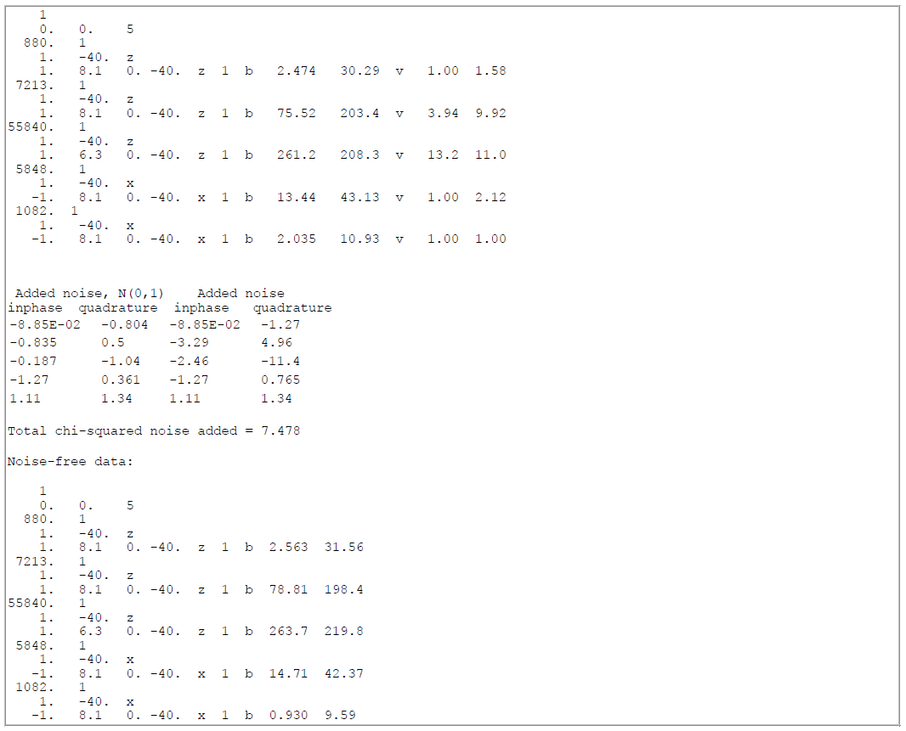

.. _EM1DFMFWD:

EM1DFMFWD Program
=================

Input file
----------

The main input file for the em1dfmfwd code sets up all aspects of the forward modeling. This includes setting: the observation file and the physical property model(s). **This file must be given the name "em1dtmfwd.in"**. The structure of the file **em1dfmfwd.in** is described below. The supporting files (**link**) and their structures were provided earlier.

Observation file
----------------

Observation files have the same format as those for the EM1DFM program. See :ref:`here<supportingFiles_obs>`. In this case, the uncertainties are no required.

Model file(s)
-------------

Formatting for conductivity and susceptibility model files is provided :ref:`here<supportingFiles_mod>`.

Output
------

The output from program EM1DFMFWD is a file called "em1dfmfwd.out". If noise has not been added, it is in the same format as the predicted data files output from program EM1DFM. If noise has been added, it is in the same format as the observations files for program EM1DFM with the standard deviations of the noise added to each data written out in place of *uncert_a*. In addition, if noise has been added, the actual noise added to each datum and the total chi-squared sum of the noise are appended to the bottom of the file *em1dfmfwd.out* along with the noise-free observations.

Consider the following conductivity and susceptibility models:

The resulting output file "em1dfmfwd.out" would be:

