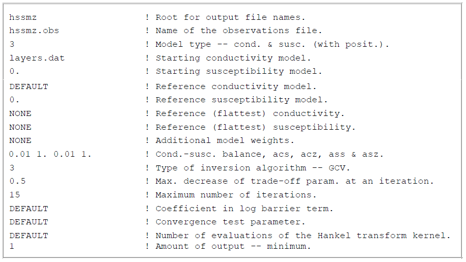

.. _inputEM1DFM:

EM1DFM Main Input File
======================

Line Descriptions
-----------------

The main input file for the em1dfm code sets up all aspects of the inversion algorithm. This includes setting: the observation file, the inversion algorithm type, what starting and reference models are used, and specifying inversion parameters. **This file must be given the name "em1dtm.in"**. The structure of the file **em1dfm.in** is described below. The supporting files (**link**) and their structures are provided on the following page.

**NOTE:**
    - some lines may be omitted depending on the inversion type chosen
    - for all file names and their paths, please avoid spaces as Fortran 90 cannot handle spaces (so do not put files in C:\Program Files on a Windows machine)
    - Apart from the root name (which must be a maximum of 20 characters with no spaces), all files specified within the input file must not contain spaces and be no longer than 99 characters

.. tabularcolumns:: |C|C|L|

+--------+------------------------------+---------------------------------------------------------------+
| Line # | Parameter                    | Description                                                   |
+========+==============================+===============================================================+
|1       |:ref:`rootname<invL1>`        |root for name for output files                                 |
+--------+------------------------------+---------------------------------------------------------------+
|2       |:ref:`obsfname<invL2>`        |name of file containing the field observations                 |
+--------+------------------------------+---------------------------------------------------------------+
|3       |:ref:`mtype<invL3>`           |flag for type of model used in the inversion                   |
+--------+------------------------------+---------------------------------------------------------------+
|3a      |:ref:`stconfname<invL3a>`     |starting conductivity model                                    |
+--------+------------------------------+---------------------------------------------------------------+ 
|3b      |:ref:`stsusfname<invL3b>`     |starting susceptibility model                                  |
+--------+------------------------------+---------------------------------------------------------------+
|3c      |:ref:`rsconfname <invL3c>`    |reference (smallest) or background conductivity model          |
+--------+------------------------------+---------------------------------------------------------------+
|3d      |:ref:`rssusfname<invL3d>`     |reference (smallest) or background susceptibility model        |
+--------+------------------------------+---------------------------------------------------------------+
|3e      |:ref:`rzconfname<invL3e>`     |reference (flattest) conductivity model                        |
+--------+------------------------------+---------------------------------------------------------------+
|3f      |:ref:`rzsusfname<invL3f>`     |reference (flattest) susceptibility model                      |
+--------+------------------------------+---------------------------------------------------------------+
|4       |:ref:`weightname<invL4>`      |additional model weights                                       |
+--------+------------------------------+---------------------------------------------------------------+
|5       |:ref:`alphas<invL5>`          |coefficients for model norm components                         |
+--------+------------------------------+---------------------------------------------------------------+
|6       |:ref:`iatype<invL6>`          |type of inversion algorithm                                    |
+--------+------------------------------+---------------------------------------------------------------+
|7       |:ref:`iapara(s)<invL7>`       |additional inversion algorithm parameter(s)                    |
+--------+------------------------------+---------------------------------------------------------------+
|8       |:ref:`maxniters<invL8>`       |maximum number of iterations in an inversion                   |
+--------+------------------------------+---------------------------------------------------------------+
|9       |:ref:`logstretch<invL9>`      |stretch factor for logarithmic barrier term                    |
+--------+------------------------------+---------------------------------------------------------------+
|10      |:ref:`numconv<invL10>`        |small number for convergence tests                             |
+--------+------------------------------+---------------------------------------------------------------+
|11      |:ref:`hankeleval<invL11>`     |number of explicit evaluations of Hankel transform kernels     |
+--------+------------------------------+---------------------------------------------------------------+
|12      |:ref:`outflg<invL12>`         |flag indicating amount of output                               |
+--------+------------------------------+---------------------------------------------------------------+

.. _invL1:

- **Line 1 - rootname:** "rootname" is the root for the names of all output files. This string must contain no more than 20 characters! For example, one might use the root name "testinv". The filenames of all output files from the inversion would therefore begin with "testinv".

.. _invL2:

- **Line 2 - obsfname:** "obsfname" is the name of the file containing the field observations. An example of the formatting of the observation file can be found here **link** (see section 3.1.2).

.. _invL3:

- **Line 3 - mtype:** "mtype" indicates the type of model being recovered in the inversion. It is specified using flag values of 1, 2, 3 or 4. The choice made here affects what is required for the remaining lines in the input file; especially the starting and reference models required. Please check all parameter lines very carefully. The types of model which can be recovered from the inversion are:

    - mtype = 1 implies just conductivity is active in the inversion
    - mtype = 2 implies just susceptibility (with positivity constrained by means of a logarithmic barrier term) is active in the inversion
    - mtype = 3 implies both conductivity and susceptibility are active with susceptibility constrained to be positive
    - mtype = 4 implies both conductivity and susceptibility are active but with no constraints on the susceptibility

.. _invL3a:

- **Line 3a - stconfname:** "stconfname" sets the starting conductivity model for the inversion. If active in the inversion, the name of the file containing the starting conductivity model is entered. The starting conductivity model can be set as the best-fitting halfspace by entering only the layer thicknesses in the file and omitting the conductivities column (i.e. a layers only file).

    - Required if mtype = 1, 3 or 4
    - Omitted if mtype = 2
    - Formatting for strconfname files **link**

.. _invL3b:

- **Line 3b - stsusfname:** "stsusfname" sets the starting susceptibility model for the inversion. If active in the inversion, several inputs types can be used to specify the starting susceptibility model.

    - Omitted if mtype = 1.
    - For mtype=2, provide the name of a model file **link** **or** a layers-only file (in which case the best-fitting halfspace is used as the starting model).
    - For mtype=3 or 4, provide the name of a model file **link**, **or** a numerical value for the halfspace susceptibility (since layer thicknesses are known from the conductivity file), **or** "DEFAULT" if the best-fitting halfspace is to be used as the starting model.
    - Formatting for stsusfname files **link**

.. _invL3c:

- **Line 3c - rsconfname:** "rsconfname" sets the reference conductivity model for the smallness term in the inversion. If active in the inversion, several inputs types can be used to specify this model.

    - Required if mtype = 2, or if mtype = 1, 3 or 4 with :math:`acs>0`
    - Enter "NONE" if not required
    - rsconfname can be entered as the name of a **model file** (**link**), **or** as a specified value for a halfspace **or** as "DEFAULT" to set as the best-fitting halfspace.
    - Formatting for rsconfname if file **link** is used

.. _invL3d:

- **Line 3d - rssusfname:** "rssusfname" sets the reference susceptibility model for the smallness term in the inversion. If active in the inversion, several inputs types can be used to specify this model.

    - Required if mtype = 1, or if mtype = 2, 3 or 4 with :math:`ass>0`
    - Enter "NONE" if not required
    - rssusfname can be entered as the name of a **model file** (**link**), **or** as a specified value for a halfspace **or** as "DEFAULT" to set as the best-fitting halfspace.
    - Formatting for rssusfname if file **link** is used

.. _invL3e:

- **Line 3e - rzconfname:** "rzconfname" sets the reference conductivity model for the flatness term in the inversion. If active in the inversion, several inputs types can be used to specify this model.

    - Optional if mtype = 1, 3 or 4
    - Enter "NONE" if you do not want a reference conductivity model in the flatness term
    - rsconfname can be entered as the name of a **model file** (**link**), **or** as a specified value for a halfspace **or** as "DEFAULT" to set as the best-fitting halfspace.
    - Formatting for rzconfname if file **link** is used

.. _invL3f:

- **Line 3f - rzsusfname:** "rzsusfname" sets the reference susceptibility model for the flatness term in the inversion. If active in the inversion, several inputs types can be used to specify this model.

    - Optional if mtype = 2, 3 or 4
    - Enter "NONE" if you do not want a reference susceptibility model in the flatness term
    - rsconfname can be entered as the name of a **model file** (**link**), **or** as a specified value for a halfspace **or** as "DEFAULT" to set as the best-fitting halfspace.
    - Formatting for rzsusfname if file **link** is used

.. _invL4:

- **Line 4 - weightname:** "weightname" can be used weight the relative contributions of layer values and gradients towards the model objective function. There are two options for this functionality.

    - Use "NONE" to indicate that no additional user-supplied weights are to be provided for use in the model norm
    - Use the name of the file containing the user-specified weights. Formatting for weightname can be found here

.. _invL5:

- **Line 5 - alphas:** "alphas" control the relative weighting of the smallness and flatness terms for the conductivity and susceptibility towards the model objective function. In the :ref:`theory <theory_alphas>`, the alphas are represented by :math:`acs`, :math:`ass`, :math:`acz` and :math:`asz`. :

    - if mtype = 1, only values for the two parameters acs and acz are entered
    - if mtype = 2, only values for the two parameters ass and asz are entered
    - if mtype = 3 or 4 enter either:
        1) the string "DEFAULT" and all four parameters acs , acz , ass and asz are required, or
        2) the six parameters Ac , As, acs , acz , ass and asz, where the value of Ac is :math:`A^c` in the expression for the model norm below, the value of As is :math:`A^s`, the value of acs is :math:`\alpha_s^c`, the value of acz is :math:`\alpha_z^c`, the value of ass is :math:`\alpha_s^s`, and the value of asz is :math:`\alpha_z^s`.

**picture needed**

.. _invL6:

- **Line 6 - iatype:** "iatype" indicates the type of inversion algorithm to be used. Each algorithm computes the trade-off parameter :math:`\beta` in a different matter. Algorithms are explained in the :ref:`theory section <theory_inversion_gen>`. Options are:

    - iatype = 1 implies a fixed, user-supplied value for the trade-off parameter
    - iatype = 2 implies that the trade-off parameter will be chosen by means of a line search so that a target misfit is achieved (or, if this is not possible, then the smallest misfit)
    - iatype = 3 implies the trade-off parameter will be chosen using the GCV criterion
    - iatype = 4 implies that the trade-off parameter will be chosen using the L-curve criterion

.. _invL7:

- **Line 7 - iapara:** "iapara" specifies the additional inversion parameters and depends on the choice for "iatype". The entries required base on type are as follows: 

    - if iatype = 1, the value of the trade-off parameter is used
    - if iatype = 2, the target misfit and greatest allowable decrease in misfit are entered and separated by a space. The target misfit is entered in terms of a chi factor (:math:`chifac`), where the target misfit is the chi factor times the total number of observations for the sounding. The greatest allowable decrease in the misfit at any one iteration is represented by :math:`mfac` (see eq. :eq:`mfac`)
    - if iatype = 3 or 4, enter the greatest allowable decrease in the trade-off parameter at any one iteration in terms of :math:`bfac` (see eq. :eq:`betachoice`)

.. _invL8:

- **Line 8 - maxniters:** "maxniters" is the maximum number of iterations to be carried out in the inversion

.. _invL9:

- **Line 9 - logstretch:** "logstretch" impacts the logarithmic barrier term for ensuring the recovered susceptibility contains strictly positive values. It is represented by :math:`c` in eq. :eq:`barrier_cond`. This field can be entered as either:

    - "DEFAULT" can be entered to indicate a value of 1
    - some other value (a strictly positive real number) can be entered (only required if mtype = 2 or 3);

.. _invL10:

**Line 10: numconv**

"Small" number for convergence tests:
    
    - either "DEFAULT" can be entered to indicate that the default value of 0.01 is to be used in the tests of convergence for an inversion, or,
    - if another value is desired, it can be entered on this line;

.. _invL11:

**Line 11: hankeleval**

Number of explicit evaluations of Hankel transform kernels:

    - either "DEFAULT" can be entered to indicate the kernel of the Hankel transforms is to be explicitly evaluated the default number of times ( = 50), or,
    - if there are concerns about the accuracy of the Hankel transform computations, a number greater than 50 can be entered on this line;

.. _invL12:

**Line 12: outflg**

outflg is the flag indicating the amount of output from the program. (WARNING: it is highly recommended that outflg = 3 or 4 is NOT specified if
there are more than a few soundings to be inverted in a single run.)

    - outflg = 1 implies the output of a brief convergence / termination report for each sounding plus the final two-dimensional composite model (cond &/or susc) for all the soundings, and the corresponding forward-modelled data. If only one sounding is being considered the model(s) are output in one-dimensional format.
    - outflg = 2 implies output as for outflg = 1 plus an iteration by iteration summary of the various components of the objective function.
    - outflg = 3 implies output as for outflg = 2 plus the one-dimensional models and corresponding predicted data for each iteration for each sounding. The diagnostics file is also produced.
    - outflg = 4 implies output as for outflg = 3 plus any line-search information from misfit, GCV function or L-curve curvature versus trade-off paramenter. Also produced is a diagnostics file for the LSQR solution routine if it is used.

Examples
--------

**Example 1**

**Example 2**

