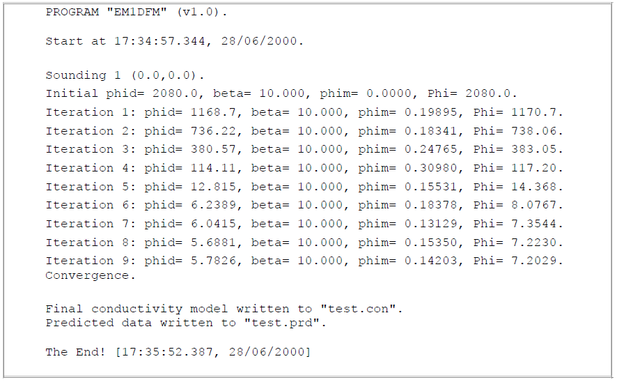
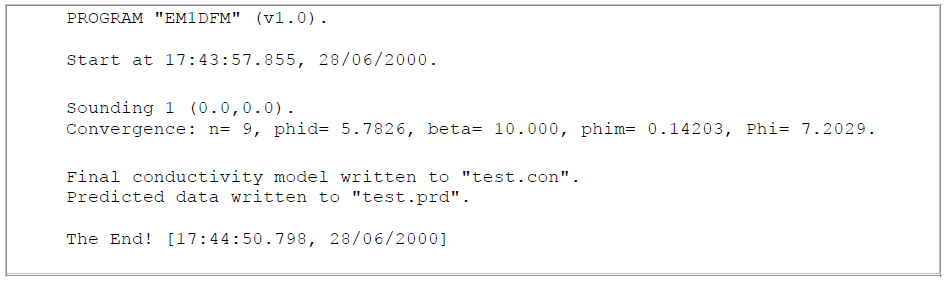
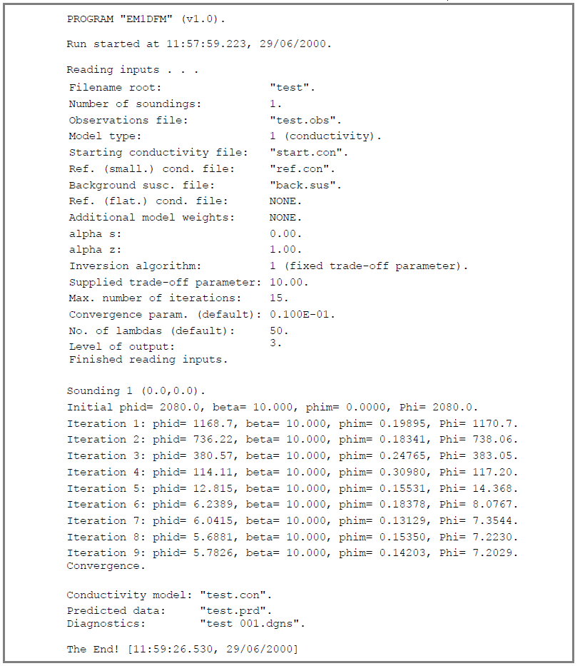
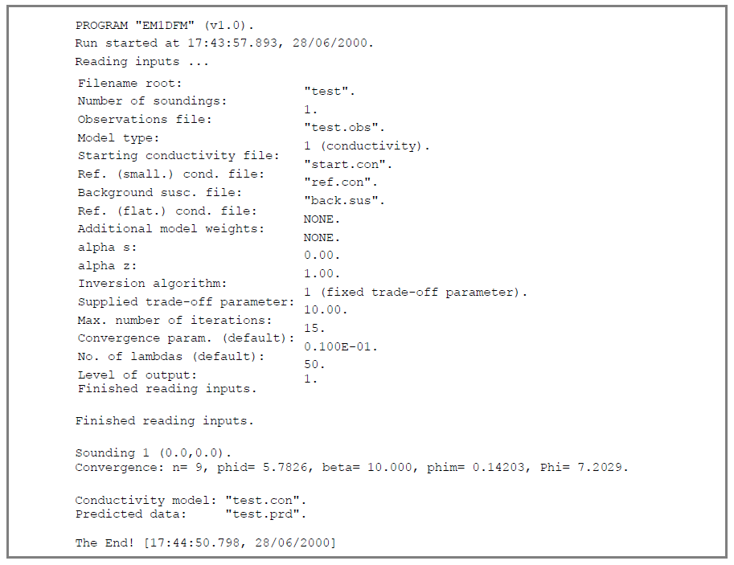
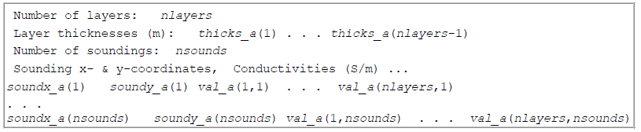
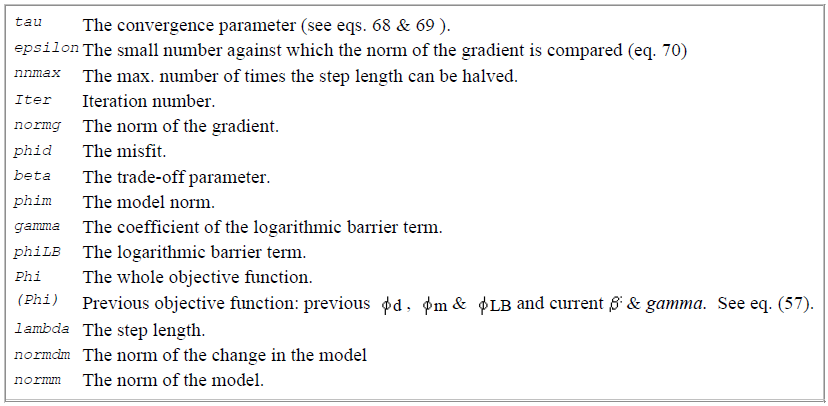

.. _outputFiles:

EM1DFM Output Files
===================

.. _outputFiles_standard:

Standard output
---------------

**Always given**

Reports on the progress of the inversion are written to the standard output (usually the screen). The amount of this output depends on the value of outflg (see line 12 of the
input file). Any error messages generated by the program will also be written to the standard output, and also to the file "em1dfm.out", which is described next.

As an example, we will look at the command line output for the :ref:`first input file example<inputEM1DFM_ex>` and the :ref:`first observation file example<supportingFiles_obs_ex>`. The starting conductivity file is the one from the :ref:`conductivity model<supportingFiles_con>` section. The reference models were: conductivity = 10 :math:`\! ^{-4}` S/m and susceptibility = 0 SI units. Since *outflag* = 3, the following was written to the standard output:

In this case, we see the iteration-by-iteration variation of the components of the objective function: the misfit, the trade-off parameter, the model norm and the complete objective
function. For exactly the same example, but for *outflg* = 1, the output gives only a summary of the final state of the inversion. Note that the final values of the components of the
objective function are also printed out. Thus:

**Description of possible status messages**

- "*Convergence:* Convergence according to the criteria given in :eq:`conv_criteria` within the :ref:`background theory<theory>` section. That is, the relative change in the objective function from one iteration to the next and the relative change in the model norm are less than the convergence parameter on line 10 of the input parameter file. Possible parameters which may appear next to *convergence* are (see :eq:`cond2`):

    - *n* - The iteration number.
    - *phid* - The misfit.
    - *beta* - The trade-off parameter.
    - *phim* - The model norm.
    - *gamma* - The coefficient of the logarithmic barrier term.
    - *phiLB* - The logarithmic barrier term.
    - *Phi* - The whole objective function.
    - *(Phi)* - Previous objective function

- *"Convergence (small gradient)":* Convergence according to the criterion given in Eq. :eq:`conv_criteria2` within the :ref:`background theory<theory>` section. That is, the gradient is essentially zero. essentially zero.

- *"Target misfit not attained convergence to minimum":* For inversion algorithm 2 the target misfit could not be reached, but convergence to the minimum misfit has occurred.

- *"No suitable step found":* No step length was found that decreased the objective function, even after being decreased by a factor of 2**nnmax*. See Eq. :eq:`mod_update` in the :ref:`background theory<theory>` section. See also the diagnostics file (link).

- *"Max number of iterations done without convergence":* The convergence criteria have not been satisfied in the specified maximum number of iterations.

- *"Starting susceptibilities reset because of small values":* When positivity is being enforced, the starting values of the susceptibilities are bumped up to be at least 0.001 SI units.

.. _outputFiles_main:

Main output file
----------------

**Always given and always called em1dfm.out**

This file contains a copy of all the progress reports that are written to the :ref:`standard output<outputFiles_standard>`. The extent of these reports depends on the parameter
:ref:`outflg<invL12>`. In addition, a summary of the inputs read in by the program are printed at the top of this file.

For the example provided in the :ref:`standard output section<outputFiles_standard>`, the file "em1dfm.out" is:

In the case that *outflg* was set to 1, the main output file would be:

Final model(s)
--------------

**Always given**

If only a single sounding is being inverted:

    - the final one-dimensional conductivity model (if conductivity is active in the inversion, i.e., *mtype* = 1, 3 or 4) will be written to the file "rootname.con". It has the same format as the input one-dimensional conductivity models (see :ref:`files for reference and starting models<supportingFiles_mod>`),
    - the final one-dimensional susceptibility model (if susceptibility is active in the inversion, i.e., *mtype* = 2, 3 or 4) will be written to the file "rootname.sus". It has the same format as the input one-dimensional susceptibility models (see :ref:`files for reference and starting models<supportingFiles_mod>`).

If two or more soundings are being inverted: 

The final one-dimensional conductivity models for all soundings (if conductivity is active in the inversion) are written to the file "rootname_con.mod", and the final one-dimensional susceptibility models for all soundings (if susceptibility is active in the inversion) are written to the file "rootname_sus.mod". The structure of these files is as follows:

- *nlayers* is the number of layers in the one-dimensional models for all soundings,
- *thicks_a(j)*, j = 1, . . ., nlayers−1, are the thicknesses of the layers in the one-dimensional models,
- *nsounds* is the number of soundings,
- *soundx_a(i)* and *soundy_a(i)*, i = 1, . . ., nsounds, are the x- and y-coordinates of the soundings, and
- *val_a(j,i)* is the value of the model (either conductivity in S/m or susceptibility in SI units) in the jth layer for the ith soundings.

If susceptibility is being written out, then "Conductivities (S/m)" on line 4 is replaced with "Susceptibilities (SI units)". The final model(s) for each sounding
are appended to this/these file(s) as soon as the inversion for each sounding has completed.

Final forward modeled data
--------------------------

**Always given**

The forward-modelled data for the final model is written to the file "rootname.prd". The format for this file is the same as that for the input observations file (see :ref:`observation file<supportingFiles_obs>`), but without the information about the uncertainties. The data for each sounding are appended to this file as soon as the inversion for each sounding has completed.

Final components of the objective function
------------------------------------------

**Always given is nsounds > 1**

If there are more than one sounding, the components of the objective function for the final model for each sounding are written out to the file "rootname_phis.out". All information for a sounding is written on one line in this file. The possible column headings are:

    - *x* - The x-coordinate of the sounding.
    - *y* - The y-coordinate of the sounding.
    - *phid* - The misfit.
    - *beta* - The trade-off parameter.
    - *phim* - The model norm.
    - *gamma* - The coefficient of the logarithmic barrier term.
    - *phiLB* - The logarithmic barrier term.
    - *Phi* - The whole objective function.
    - *phim con* - The conductivity part of the model norm.
    - *phim sus* - The susceptibility part of the model norm.

The values are appended to this file on completion of the inversion for each sounding.

Iteration-by-iteration one-dimensional models for each sounding
---------------------------------------------------------------

**Only if outflg >= 3**

If *outflg* >= 3, the one-dimensional conductivity and/or susceptibility model(s) obtained at each iteration in the inversion for each sounding are written out.

    - The conductivity models are written to the files "rootname_isound_iter.con" where *isound* is the number of the sounding and *iter* is the number of the iteration (*iter* = 0 indicates the starting conductivity model). These files have the same format as the input conductivity files (see :ref:`files for reference and starting models<supportingFiles_mod>`).
    - The susceptibility models are written to the files "rootname_isound_iter.sus" where *isound* is the number of the sounding and *iter* is the number of the iteration (*iter* = 0 indicates the starting susceptibility model). These files have the same format as the input susceptibility files (see :ref:`files for reference and starting models<supportingFiles_mod>`).
    - If only conductivity is active in the inversion, the background susceptibility is written out to the file "rootname_isound.sus".
    - If only susceptibility is active in the inversion, the background conductivity is written out to the file "rootname_isound.con".

Iteration-by-iteration forward-modelled data for each sounding
--------------------------------------------------------------

**Only if outflg >= 3**

If *outflg* >= 3, the forward-modelled data for each iteration for each sounding are written out to the files "rootname_isound_iter.dprd" where *isound* is the number of
the sounding and *iter* is the number of the iteration (*iter* = 0 indicates the forward-modelled data for the starting model). The data are written out as they are ordered in
the input observations file, but with none of the survey parameters. The observations (including their uncertainties) for each sounding are also written out in this format to
the file "rootname_isound.dobs".

Diagnostics for each iteration for each inversion
-------------------------------------------------

**Only if outflg >= 3**

If *outflg* >= 3, the values of all the interesting quantities at each iteration for each sounding are written to the file(s) "rootname_isound.dgns", where *isound* is the
number of the sounding. The possible quantities in these files are summarized in the following table. References to equations are found in the :ref:`inversion methodology section <theory_inversion>`.

The same status message as that written to the standard output and em1dfm.out is also written to this file.

Misfit line search values
-------------------------

**Only if outflg = 4 and iatype = 2**

If *outflg* = 4, and *iatype* = 2 (i.e., a line search over the misfit is used at each iteration to choose the trade-off parameter - see :ref:`discrepency principle<theory_inversion_disc>`, the values of the trade-off parameter and the corresponding values of the misfit during each line search at each iteration of each inversion are written to the file "phidvsbeta". There is just a single such file for a whole run of the program with information from each iteration separated by pairs of dashed lines. Note that the pairs of values of the trade-off parameter and misfit are written out in the order in which they are computed during the line search: they are not re-ordered.

GCV function line search values
-------------------------------

**Only if outflg = 4 and iatype = 3**

If *outflg* = 4, and *iatype* = 3 (i.e., a line search over the GCV function is used at each iteration to choose the trade-off parameter - see :ref:`GCV criterion<theory_inversion_gcv>`, the values of the trade-off parameter and the corresponding values of the GCV function during each line search at each iteration of each inversion are written to the file "GCVvsbeta". There is just a single such file for a whole run of the program with information from each iteration separated by pairs of dashed lines. Note that the pairs of values of the trade-off parameter and GCV function are written out in the order in which they are computed during the line search: they
are not re-ordered.

L-curve line search diagnostics
-------------------------------

**Only if outflg = 4 and iatype = 4**

If *outflg* = 4, and *iatype* = 4 (i.e., a line search over the curvature of the L-curve is used at each iteration to choose the trade-off parameter - see :ref:`L-curve criterion<theory_inversion_lcurve>`, the values of the trade-off parameter and the corresponding values of the linearized misfit and the model norm during each line search at each iteration of each inversion are written to the file "phisvsbeta", and the values of the trade-off parameter and the corresponding values of the curvature computed in log-log/linear space are written to the files "curlovsbeta"/"curvlivsbeta". There is just a single version of each of these files for a whole run of the program with the information for each iteration separated from that for others by pairs of dashed lines.

Diagnostics for LSQR subroutine
-------------------------------

**Only if outflg = 4**

If *outflg* = 4, diagnostics are written out from Saunder's LSQR subroutine to the file "lsqr.out". Warning: this file can become very large very quickly if there is more
than one sounding.

