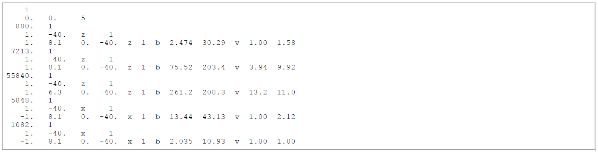
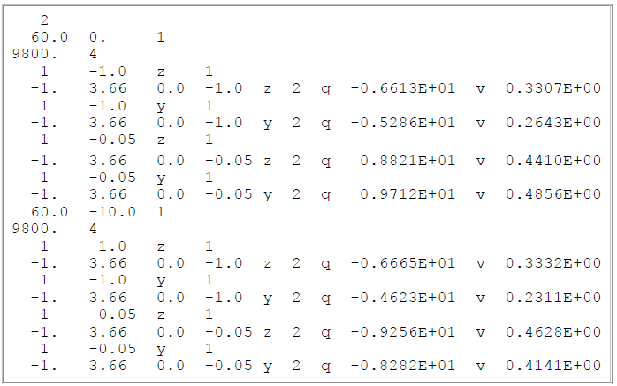

.. _supportingFiles:

Supporting Files
================

.. _supportingFiles_obs:

Observation File
----------------

This file contains the observations and all the survey parameters, with five lines including parameters as follows:

    1. the number of soundings;
    2. the x- and y-coordinates of each sounding, and the number of frequencies per sounding;
    3. each frequency, and the number of transmitters for each frequency;
    4. the dipole moment of each transmitter, their z-coordinates and orientations, and the number of receivers for each;
    5. the last line contains all of
        - the dipole moment of each receiver,
        - the transmitter-receiver separation in the x- and y-directions,
        - the z-coordinate and orientation of each receiver,
        - what type of normalization has been applied to the observations,
        - whether in-phase and/or quadrature data are present,
        - the actual observed field values for this receiver, and
        - the type of uncertainties and their values.

**The structure of the observations file is as follows.** Click on the letter labels for variable names, and for parameter details:

| :ref:`nsounds<obsA>`
| :ref:`soundx_a<obsB>`  :ref:`soundy_a<obsC>`  :ref:`nfreqs_a<obsD>` 
| :ref:`freq_a<obsE>`  :ref:`nt_a<obsF>`
| :ref:`momt_a<obsG>`  :ref:`zt_a<obsH>`  :ref:`ot_a<obsI>`  :ref:`nr_a<obsJ>`
| :ref:`momr_a<obsK>`  :ref:`trx_a<obsL>`  :ref:`try_a<obsM>`  :ref:`zr_a<obsN>`  :ref:`or_a<obsO>`  :ref:`ontype_a<obsP>`  :ref:`octype_a<obsQ>`  :ref:`obs_a<obsR>`  :ref:`utype_a<obsS>`  :ref:`uncert_a<obsT>`
|
|

.. _obsA:

- :math:`\mathbf{nsounds}` is the number of soundings

.. _obsB:

- :math:`\mathbf{soundx\_ a(i_s)}` is the x-coordinate of the :math:`i_s^{th}` sounding

.. _obsC:

- :math:`\mathbf{soundy\_ a(i_s)}` is the y-coordinate of the :math:`i_s^{th}` sounding

.. _obsD:

- :math:`\mathbf{nfreqs \_ a(i_s)}` is the number of frequencies for the :math:`i_s^{th}` sounding

.. _obsE:

- :math:`\mathbf{freq\_ a(i_f, i_s)}` is the frequency (Hz) of the :math:`i_f^{th}` frequency for the :math:`i_s^{th}` sounding

.. _obsF:

- :math:`\mathbf{nt\_ a(i_f,i_s)}` is the number of transmitters for the :math:`i_f^{th}` frequency for the :math:`i_s^{th}` sounding

.. _obsG:

- :math:`\mathbf{momt\_ a(i_t,i_f,i_s)}` is the dipole moment (Am :math:`\! ^2`) of the :math:`i_t^{th}` transmitter for the :math:`i_f^{th}` for the :math:`i_s^{th}` sounding
    - This number is used as a simple scaling within the program. If :math:`momt_a` = 2, then the forward-modelled observations are twice what they would be if :math:`momt_a` = 1.

.. _obsH:

- :math:`\mathbf{zt\_ a (i_t,i_f,i_s)}` is the z-coordinate (metres, negative upwards from zero on the Earth's surface) of the :math:`i_t^{th}` transmitter for the :math:`i_f^{th}` frequency for the :math:`i_s^{th}` sounding

.. _obsI:

- :math:`\mathbf{ot\_a(i_t,i_f,i_s)}` is the orientation of the :math:`i_t^{th}` transmitter for the :math:`i_f^{th}` frequency for the :math:`i_s^{th}` sounding ("x" for an x-directed dipole, "y" for a y-directed dipole, and "z" for a vertical (downward-directed) dipole)

.. _obsJ:

- :math:`\mathbf{nr\_ a(i_t,i_f,i_s)}` is the number of receivers for the :math:`i_t^{th}` transmitter for the :math:`i_f^{th}` frequency for the :math:`i_s^{th}` sounding

.. _obsK:

- :math:`\mathbf{momr\_ a(i_t,i_f,i_s)}` is a scale factor for the :math:`i_r^{th}` receiver for the :math:`i_t^{th}` transmitter for the :math:`i_f^{th}` frequency for the :math:`i_s^{th}` sounding which allows the incorporation of any necessary parameters of the receiver that might mean the observations are not simply point measurements of the H-field.

    - An example of necessary parameters could be coil area and/or number of turns and/or orientation (e.g., :math:`momr_a` = −1 for an upward-pointing z-directed receiver dipole).
    - This number simply appears as a scale factor within the code (i.e. if :math:`momr_a` = 2, then the forward-modelled observations are twice what they would be if :math:`momr_a` = 1)
    - *NOTE*: Some common data formats (such as DIGEM coaxial data - not coplanar data) require :math:`momr_a` = -1 to make these data compatible with the normalization convention used by EM1DFM. The first example requires this type of normalization

.. _obsL:

- :math:`\mathbf{trx\_ a(i_r,i_t,i_f,i_s)}` is the transmitter-receiver separation (m) in the x-direction between the :math:`i_r^{th}` receiver and the :math:`i_t^{th}` transmitter for the :math:`i_f^{th}` frequency for the :math:`i_s^{th}` sounding

.. _obsM:

- :math:`\mathbf{try\_ a(i_r,i_t,i_f,i_s)}` is the transmitter-receiver separation (m) in the y-direction between the :math:`i_r^{th}` receiver and the :math:`i_t^{th}` transmitter for the :math:`i_f^{th}` frequency for the :math:`i_s^{th}` sounding

.. _obsN:

- :math:`\mathbf{zr\_ a(i_r,i_t,i_f,i_s)}` is the z-component (metres, negative upwards from zero on the Earth's surface) of the :math:`i_r^{th}` receiver for the :math:`i_t^{th}` transmitter for the :math:`i_f^{th}` frequency for the :math:`i_s^{th}` sounding

.. _obsO:

- :math:`\mathbf{or\_ a(i_r,i_t,i_f,i_s)}` is the orientation of the :math:`i_r^{th}` receiver for the :math:`i_t^{th}` transmitter for the :math:`i_f^{th}` frequency for the :math:`i_s^{th}` sounding
    - "x" for an x-directed dipole,
    - "y" for a y-directed dipole, and
    - "z" for a vertical (downward-directed) dipole

.. _obsP:

- :math:`\mathbf{ontype\_ a(i_r,i_t,i_f,i_s)}` is the type of normalization of the data/datum for the :math:`i_r^{th}` receiver for the :math:`i_t^{th}` transmitter for the :math:`i_f^{th}` frequency for the :math:`i_s^{th}` sounding

    - :math:`ontype\_ a` = 1 indicates the data are values in ppm of the secondary magnetic field normalized by the free-space magnetic field
    - :math:`ontype\_ a` = 2 indicates the data are values in % of the secondary magnetic field normalized by the free-space magnetic field
    - :math:`ontype\_ a` = 3 indicates the data are values of the secondary H-field in A/m, and
    - :math:`ontype\_ a` = 4 indicates the data are values of the total H-field in A/m

.. _obsQ:

- :math:`\mathbf{octype\_ a(i_r,i_t,i_f,i_s)}` is the observation type for the :math:`i_r^{th}` receiver for the :math:`i_t^{th}` transmitter for the :math:`i_f^{th}` frequency for the :math:`i_s^{th}` sounding

    - :math:`octype\_ a` = "b" indicates both inphase and quadrature observations are present
    - :math:`octype\_ a` = "i" just the inphase observation is present
    - :math:`octype\_ a` = "q" just the quadrature datum

.. _obsR:

- :math:`\mathbf{obs\_ a(i_r,i_t,i_f,i_s)}` is the pair of inphase and quadrature observations, or just the in-phase observation, or just the quadrature observation, for the :math:`i_r^{th}` receiver for the :math:`i_t^{th}` transmitter for the :math:`i_f^{th}` frequency for the :math:`i_s^{th}` sounding

.. _obsS:

- :math:`\mathbf{utype\_ a(i_r,i_t,i_f,i_s)}` indicates the form in which the uncertainties are provided for the :math:`i_r^{th}` receiver for the :math:`i_t^{th}` transmitter for the :math:`i_f^{th}` frequency for the :math:`i_s^{th}` sounding

    - :math:`utype\_ a` = "v" for absolute uncertainties in the same units as the observations, and
    - :math:`utype\_ a` = "p" percentage uncertainties

.. _obsT:

- :math:`\mathbf{uncert\_ a(i_r,i_t,i_f,i_s)}` is the pair of uncertainties for the inphase and quadrature observations, or the uncertainty in just the inphase observation, or the uncertainty in just the quadrature observation, for the :math:`i_r^{th}` receiver for the :math:`i_t^{th}` transmitter for the :math:`i_f^{th}` frequency for the :math:`i_s^{th}` sounding

|
|

**Example for a single sounding**

The observations file for a single sounding (that is, a single one-dimensional model) at x = 0 m, y = 0 m for an airborne-type configuration is shown below.

- There are three frequencies for the horizontal coplanar loop configuration (880, 7213, 55840 Hz)

    - a z-directed magnetic dipole transmitter (dipole moment = 1 Am :math:`\! ^2`) and receiver (dipole moment = 1 Am :math:`\! ^2`) for each frequency separated by 8.1 m, 8.1 m and 6.3 m respectively in the x-direction, 0 m in the y-direction
    - both transmitter and receiver for each frequency are at a height of 40 m above the Earth's surface
- There are two frequencies for the coaxial loop configuration (5848 and 1082 Hz)

    - an x-directed magnetic dipole transmitter (dipole moment = 1 A m2) and receiver (dipole moment = −1 A m2) for both frequencies separated by 8.1 m in the x-direction and 0 m in the y-direction;
    - both transmitter and receiver for each frequency are at a height of 40 m above the Earth's surface.
- The observations are values of the secondary magnetic field normalized by the free-space field and expressed in terms of parts-per-million (ppm).
- Both inphase and quadrature components of the field are supplied.
- The uncertainties are expressed in absolute terms in the same units as the observations (i.e., ppm).

**Example for EM-31 data for two soundings**

The observations file for EM31-type data for two soundings is shown below

- Sounding locations are at x = 60 m \& y = 0 m and x = 60 m & y = −10 m.
- There is one frequency (9.6 kHz),
- There are four instrument positions:

    - at waist height (1 m) and on the ground (0.05 m),
    - held both normally (vertical transmitter and receiver coil axes) and on its side (horizontal coil axes).
- The transmitter and receiver coils are separated by 3.66 m in the x-direction. Only the quadrature part of the normalized secondary H-field (in %) is provided as data,
- The uncertainties are absolute in \%.

