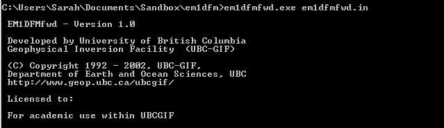

Running the programs
====================

The software package EM1DFM contains 2 codes:

   - **EM1DFM:** carries out the inversion of small loop, frequency-domain EM data assuming a layered Earth model
   - **EM1DFMFWD:** a stand-alone program for forward modeling the frequency-domain response assuming a layered Earth model

Command Prompt/Terminal Syntax
------------------------------

Both programs in the package can be executed within Windows or Linux environments. They can be run by typing the program name followed by the :ref:`main input file<inputEM1DFM>` name into the ``command prompt`` (Windows) or ``terminal`` (Linux); the program and main input file are separated by a space. 

For success, ensure the following:

    - That the current directory in the command line is the same as the directory where the :ref:`main input file<inputEM1DFM>` and all :ref:`supporting files<supportingFiles>` are located
    - That you have pathed the location of the EM1DFM and/or EM1DFMFWD to you environment variables (only if you want to avoid entering the entire filepath of the executable)
    - That the formatting of the main input file and all supporting files are correct

Command Prompt/Terminal Outputs
-------------------------------

Upon execution, outputs are displayed through the command prompt/terminal to indicate whether the program is running successfully. If there are errors, the output message will indicate the nature of the error. When running an inversion, the command prompt/terminal will display status messages. Status messages are are described in the :ref:`Standard Output<outputFiles_standard>` section.

